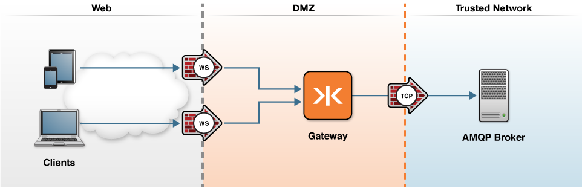

# RabbitMQ AMQP Proxy

This tutorial shows how to connect AMQP clients to an AMQP broker via the Gateway using WebSocket.

### Getting Started

To run this example, you must have installed Docker and have added a host file entry for `kaazing.example.com`, as described [here](../../README.md)

The [docker-compose.yml](docker-compose.yml) describes two containers it will run: the Gateway and the RabbitMQ broker. These will be launched in the following configuration:



The Gateway container will run a `amqp.proxy` service that allows WebSocket clients to connect on the front-end. Clients will connect on a `wss://` address which denotes a TLS-secured WebSocket URL. The [Gateway config file](gateway/amqp-rabbitmq-gateway-config.xml) is configured with an `amqp.proxy` service as follows:

```xml
  <service>
    <name>AMQP Tutorial Service</name>
    <description>A service that proxys to an AMQP backend</description>
    <accept>wss://kaazing.example.com:8000/</accept>
    <connect>tcp://rabbitmq:5672</connect>

    <type>amqp.proxy</type>

    <cross-site-constraint>
      <!-- Only WebSockets coming from this origin can access this url -->
      <allow-origin>https://kaazing.example.com:8000/</allow-origin>
    </cross-site-constraint>
  </service>
```

### Run

1. Start the containers
  ```bash
  docker-compose up -d
  ```
  
2. Connect to the Gateway in a Web browser via [https://kaazing.example.com:8000/](https://kaazing.example.com:8000/).  You might see a security error saying the certificate is not trusted.  This is the result of using a self-signed certificate.  Proceed anyways (in Chrome this is under the Advanced drop-down menu).  This step will temporarily add the generated self-signed certificate to your computer's truststore.

3. Change the connect URL of the demo to `wss://kaazing.example.com:8000/` and connect.

4. Subscribe and publish AMQP messages as desired.

### Next Steps
  
[See Deployment Scenarios](../../README.md#deployment-scenarios)
