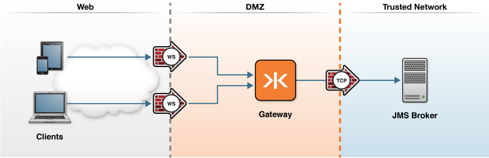

# JMS and WebSocket  

The following topology graphic depicts how this scenario would be deployed in an enterprise environment.

The Gateway can be configured as a front-end for JMS, accepting WebSocket JMS client connections and messages and communicating with a backend JMS broker.  Example configurations are shown for:

* [ActiveMQ](activemq)
* IBM WebSphere / IBMQ - example coming soon
* Amazon SQS JMS Adapter - example coming soon
