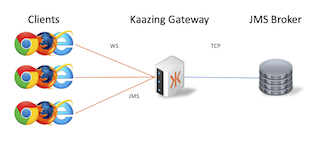

# JMS/ActiveMQ with Kaazing Gateway

This tutorial shows how to connect websocket clients to JMS

### Getting Started

To run this you must have installed docker and have added a host file entry for kaazing.example.com, as described [here](../../README.md)

The [docker-compose.yml](docker-compose.yml) describes two containers it will run: the gateway and the ActiveMQ broker.  These will be launched in the following configuration



The gateway container will run a jms service that allows WebSocket clients to connect on the front end.  Clients will connect on a "wss" address which denotes a TLS secured websocket url.  The [gateway config file](gateway/jms-activemq-gateway-config.xml) is configured with a jms service as follows:

```xml
  <service>
    <name>JMS Tutorial Service</name>
    <description>A service that proxys to an JMS backend</description>
    <accept>wss://kaazing.example.com:8000/</accept>

    <type>jms</type>

    <properties>
      <connection.factory.name>ConnectionFactory</connection.factory.name>
      <context.lookup.topic.format>dynamicTopics/%s</context.lookup.topic.format>
      <context.lookup.queue.format>dynamicQueues/%s</context.lookup.queue.format>
      <env.java.naming.factory.initial>org.apache.activemq.jndi.ActiveMQInitialContextFactory</env.java.naming.factory.initial>
      <env.java.naming.provider.url>tcp://activemq:61616</env.java.naming.provider.url>
    </properties>

    <cross-site-constraint>
      <!-- Only websockets coming from this origin can access this url -->
      <allow-origin>https://kaazing.example.com:8000/</allow-origin>
    </cross-site-constraint>
  </service>
```

### Run

1. Start the containers
  ```bash
  docker-compose up -d
  ```
  
2. Connect to the gateway in a web browser via [https://kaazing.example.com:8000/](https://kaazing.example.com:8000/).  You may see a security error saying the certificate is not trusted.  This is because we are using a self-signed certificate.  Proceed anyways (in chrome this is under the advanced drop down displayed).  This will temporarily add the generated self-signed certificate to you truststore.

3. Change the connect url of the demo to `wss://kaazing.example.com:8000/` and connect

4. Subscribe/Publish JMS messages as desired

### Next Steps
  
- Configure JMS for high availability (Example coming soon)
- [Secure your JMS infrastructure with Enterprise Shield](../../enterprise-shield)
