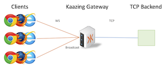
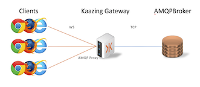
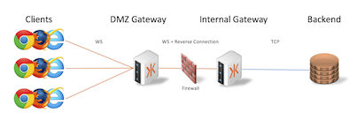

# Kaazing Gateway Docker Tutorials

This repository provides example Docker configurations for several Kaazing Gateway deployment scenarios.  The scenarios build upon each other, from a simple TCP braodcast scenario to more advanced protocols and architectures. You can follow the scenarios in order to learn how to configure the Gateway with Docker from the ground up, or you can jump directly to the scenario you are interested in.

### Requirements

These tutorials require that you have Docker and Docker Compose installed.  If this is your first time using Docker follow the Docker Getting Started Guides:

  - [Mac](https://docs.docker.com/mac/)
  - [Linux](https://docs.docker.com/linux/)
  - [Windows](https://docs.docker.com/windows/).

These tutorials also require that the host name `kaazing.example.com` resolve to the Docker host machine. To enable this resolution, add an entry in your [hosts file](https://en.wikipedia.org/wiki/Hosts_(file)) for `kaazing.example.com` that points to your Docker host's IP address.For example, if you are using Docker Machine, you can get the IP address with this command: `docker-machine ip`. If you are using Kitematic, go to **Settings** then **Ports**. For other examples, see [10 Examples of how to get Docker Container IP Address](http://networkstatic.net/10-examples-of-how-to-get-docker-container-ip-address/).

### Scenarios

Each subdirectory contains a scenario listed below and provides instructions on how to run the setup locally.

** ![EE] marks demos that require the Enterprise Edition.

* [Broadcasting TCP data to WebSocket clients](broadcast)

* [Enable WSS (TLS)](wss)

* [Authorizing Users](user-auth)

* [AMQP and WebSocket](AMQP)

* [JMS and WebSocket](JMS)  ![EE]

* [Securing your deployments with Enterprise Shield&trade; (No open port Firewall for any service)](enterprise-shield) ![EE]

 

* [Redis and WebSocket](redis)  ![EE]

* Http Proxy (example coming soon)

* High Availability and Clustering (example coming soon) 

* KWIC (example coming soon)  ![EE]

[EE]: enterprise-feature.png "Enterprise Edition Feature"
