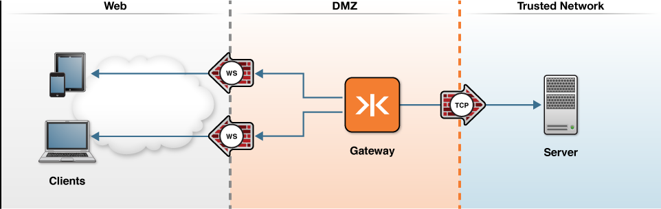

# Broadcasting TCP Data to WebSocket Clients

The following topology graphic depicts how this scenario would be deployed in an enterprise environment.

The Gateway can be configured to broadcast any TCP backend to WebSocket clients. Example configurations are shown for:

* [Netcat](netcat)
* Node.js&reg; TCP Server - coming soon.
