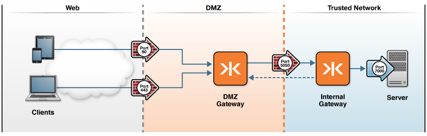

# Deploy Enterprise Shield with AMQP via RabbitMQ 

This tutorial shows how to secure Gateway connections using Enterprise Shield&trade;.

### Getting Started

To run this example, you must have Docker installed and have added a host file entry for `kaazing.example.com`, as described [here](../../../README.md).

The [docker-compose.yml](docker-compose.yml) describes two containers it will run: the Gateway and RabbitMQ broker.  These will be launched in the following configuration



The internal Gateway container will run `amqp.proxy` and `directory` services that allow the DMZ Gateway to connect to this internal Gateway. The internal Gateway config file is configured with the following services:

```xml
<service>
	<name>AMQP Tutorial Service</name>
	<description>A service that proxys to an AMQP backend</description>
	<accept>wss://internal.example.com:8000/path2/</accept>
	<connect>tcp://rabbitmq:5672</connect>

	<type>amqp.proxy</type>

	<accept-options>
		<http.transport>socks://kaazing.example.com:8001</http.transport>
		<socks.mode>reverse</socks.mode>
	</accept-options>

</service>

<service>
	<name>Directory Service</name>
	<description>
		Directory Service to serve up secure pages with, file
		in web directory are available via https
	</description>

	<accept>https://internal.example.com/path1/</accept>

	<type>directory</type>

	<properties>
		<directory>/javascript.client.tutorials/amqp</directory>
		<welcome-file>index.html</welcome-file>
	</properties>

	<accept-options>
		<https.bind>443</https.bind>
		<http.transport>socks://kaazing.example.com:8001</http.transport>
		<socks.mode>reverse</socks.mode> 
	</accept-options>
</service>
```

The DMZ Gateway container will run `proxy` and `http.proxy` services that allow WebSocket clients to connect on the front-end. Clients will connect on a `wss://` address which denotes a TLS-secured WebSocket URL. The Gateway config file is configured with the following services:

```xml
<service>
	<name>WS Proxy DMZ Gateway</name>
	<description>A DMZ proxy that forwards websocket connections</description>
	<accept>wss://kaazing.example.com:8000/</accept>
	<connect>wss://internal.example.com:8000/path2/</connect>

	<type>proxy</type>

	<connect-options>
		<http.transport>socks+ssl://kaazing.example.com:8001</http.transport>
		<socks.mode>reverse</socks.mode>
	</connect-options>
  
	<cross-site-constraint>
		<!-- Only websockets coming from this origin can access this url -->
		<allow-origin>https://kaazing.example.com:8000/</allow-origin>
	</cross-site-constraint>
</service>

<service>
	<name>Http Proxy DMZ Gateway</name>
	<description>A DMZ that has no application logic that can be attacked</description>
	<accept>https://kaazing.example.com:8000/</accept>
	<connect>https://internal.example.com/path1/</connect>

	<!-- NOTE: http.proxy is currently a BETA release -->
	<type>http.proxy</type>

	<connect-options>
		<http.transport>socks+ssl://kaazing.example.com:8001</http.transport>
		<socks.mode>reverse</socks.mode>
	</connect-options>
</service>
```

### Run

1. Start the containers
  ```bash
  docker-compose up -d
  ```

2. Connect to the DMZ Gateway in a Web browser via [https://kaazing.example.com:8000/].  You might see a security error saying the certificate is not trusted. This is the result of using a self-signed certificate. Proceed anyways (in Chrome this is under the **Advanced** drop-down menu). This step will temporarily add the generated self-signed certificate to your computer's truststore.

3. Change the connect URL of the demo to `wss://kaazing.example.com:8000/` and connect.

4.  Subscribe and publish AMQP messages as desired.

### Next Steps
  
[See Deployment Scenarios](../../README.md#deployment-scenarios)
