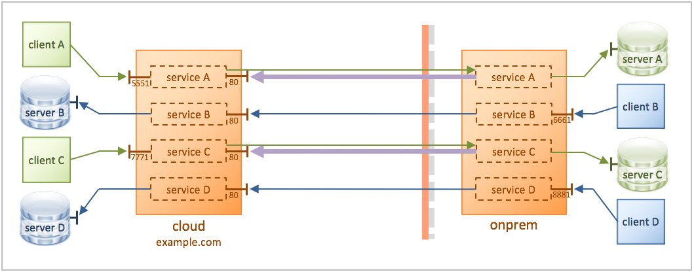

# KWIC

Demonstrate a simple KWIC scenario. For simplicity, this scenario is in the clear without TLS/SSL.



In this scenario, the on-premise side is behind a firewall. (There is no actual firewall deployed in this tutorial, but the configuration is consistent with a firewall being present.)

All endpoint servers are stubbed out with echo services for simplicity (**server A**, **server B**, **server C**, **server D**).

## Connecting from cloud to on-premise

These cases are shown in green in the diagram.

There are two clients in the cloud side, **client A** and **client C**, who can connect to two servers on premise, **server A** and **server C**. The clients initiate connectivity by connecting to the cloud KWIC instance on ports 5551 and 7771, which get proxied through KWIC to the servers on premise.

The purple arrows indicate a (psychical) reverse connection made from the on-premise KWIC instance to the cloud KWIC instance. This reverse connection is then consumed by the (logical) forwards connection created when the client connects.

## Connecting from on-premise to cloud

These cases are shown in blue in the diagram.

There are two on-premise clients, **client B** and **client D**, who can connect to two servers in the cloud, **server B** and **server D**. The clients initiate connectivity by connecting to the on-premise KWIC instance on ports 6661 and 8881, which get proxied through KWIC to the servers on premise.

No reverse connectivity is needed for these cases because the firewall will allow outbound connections.

## Configuration

The configuration for the cloud KWIC instance is in [config/cloud-config.xml](config/cloud-config.xml).

The configuration for the on-prem KWIC instance is in [config/onprem-config.xml](config/onprem-config.xml).

# Requirements

* You will need Docker and Docker Compose.

* If you don't have **netcat** installed on your system (the `nc` command) then you will need to use a netcat substitute.

See the the **Requirements** section in the [main README](../../README.md) for details of the above.

This tutorial does not need any modification to your hosts file.

# Running the tutorial

In this tutorial you will use **netcat** for the TCP clients **client A**, **client B**, **client C**, and **client D**. You run netcat by specifying a hostname or IP address, and a port. Once it is connected, you can type something and hit Enter, and you will see your message echoed back from the server.

If you are running on Windows, or don't have netcat installed, everywhere you see `nc 192.168.99.100 5551` in the steps below, replace it with the following command:

```bash
docker run -it --rm konjak/netcat 192.168.99.100 5551
```

## Steps

1. In a terminal window, use Docker Compose to launch all of the Docker containers:

    ```bash
    $ docker-compose up
    ```

    It may take a few moments for all of the containers to start. It's probably ready when you see something like the following lines in the log output on the screen:

    ```
    example.com_1  | INFO  [wsn#4 172.32.0.5:36764] OPENED: (#00000004: kzg wsn, server, ws://example.com:80/kwic => ws://example.com/kwic)
    example.com_1  | INFO  [wsn#6 172.32.0.5:36766] OPENED: (#00000006: kzg wsn, server, ws://example.com:80/kwic => ws://example.com/kwic)
    onprem_1       | INFO  [wsn#5 172.32.0.5:36764] OPENED: (#00000005: kzg wsn, client, ws://example.com:80/kwic => ws://example.com/kwic)
    onprem_1       | INFO  [wsn#6 172.32.0.5:36766] OPENED: (#00000006: kzg wsn, client, ws://example.com:80/kwic => ws://example.com/kwic)
    ```

    Those lines indicate that the on-prem instance established a reverse connection to the cloud instance. Since there are two services with reverse connectivity – **proxy service A** and **proxy service C** – we expect to see two pair of log lines (for a total of 4 lines).

1. In another terminal window, test **client A** connecting to **server A** using netcat. Once it is connected, type `hello` and hit Enter. You will see your message echoed back. Type some more messages if you like, pressing Enter each time. When done, press Ctrl-C to exit netcat.

    ```bash
    $ nc 192.168.99.100 5551
    hello
    hello
    ^C
    ```

    If you don't have netcat installed, then do `docker run -it --rm konjak/netcat 192.168.99.100 5551`.

    If you successfully see the message echoed back, then you know there was roundtrip communication from the netcat client, through the cloud KWIC instance, through the on-prem KWIC instance, to the endpoint **server A**, and back.

1. Test the other servers in the same way:

    ```bash
    # Test client B to server B
    $ nc 192.168.99.100 6661
    world
    world
    ^C
    # Test client C to server C
    $ nc 192.168.99.100 7771
    foo
    foo
    ^C
    # Test client D to server D
    $ nc 192.168.99.100 8881
    bar
    bar
    ^C
    ```
