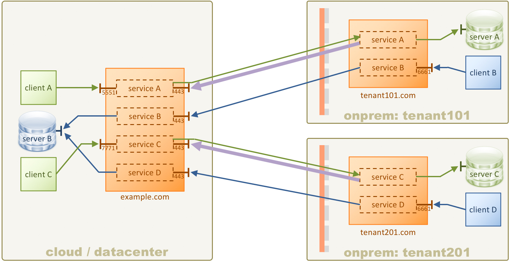

# KWIC Multi-Tenant

(**Note:** Please complete the [1-Simple](../1-simple) and [2-tls](../2-tls) tutorials before starting this one.)

Demonstrate a multi-tenant KWIC scenario. This tutorial includes TLS/SSL.



This tutorial shows how to have a single KWIC instance in the cloud servicing multiple independent tenants. In this scenario, all connections inbound to the cloud connect to the same server, **server B**.

## Configuration

The configuration for the cloud KWIC instance is in [config/cloud-config.xml](config/cloud-config.xml).

The configuration for tenant101 KWIC instance is in [config/tenant101-config.xml](config/tenant101-config.xml).

The configuration for tenant201 KWIC instance is in [config/tenant201-config.xml](config/tenant201-config.xml).

This tutorial uses TLS, so all keys, certificates, and other TLS artifacts are generated automatically when the Docker Compose suite starts.

# Requirements

* You will need Docker and Docker Compose.

* If you don't have **netcat** installed on your system (the `nc` command) then you will need to use a netcat substitute.

See the the **Requirements** section in the [main README](../../README.md) for details of the above.

This tutorial does not need any modification to your hosts file.

# Running the tutorial

In this tutorial you will use **netcat** for the TCP clients **client A**, **client B**. You run netcat by specifying a hostname or IP address, and a port. Once it is connected, you can type something and hit Enter, and you will see your message echoed back from the server.

If you are running on Windows, or don't have netcat installed, everywhere you see `nc 192.168.99.100 5551` in the steps below, replace it with the following command:

```bash
docker run -it --rm konjak/netcat 192.168.99.100 5551
```

## Steps

1. In a terminal window, use Docker Compose to launch all of the Docker containers:

    ```bash
    $ docker-compose up
    ```

    It may take a few moments for all of the containers to start. It's probably ready when you see something like the following lines in the log output on the screen (note that these lines may not be grouped together in the output depending on the order Docker starts containers):

    ```
    tenant101_1    | INFO  [tcp#1 172.33.0.101:38982] OPENED: (#00000001: kaazing tcp, client, /172.33.0.101:38982 => /172.33.0.3:443)
    example.com_1  | INFO  [tcp#1 172.33.0.101:38982] OPENED: (#00000001: kaazing tcp, server, /172.33.0.101:38982 => /172.33.0.3:443)
    example.com_1  | DEBUG SSL session ID [B@3349e45a on transport session #1 (#00000001: kaazing tcp, server, /172.33.0.101:38982 => /172.33.0.3:443): cipher TLS_RSA_WITH_AES_256_CBC_SHA, app buffer size 16916, packet buffer size 16921
    example.com_1  | DEBUG SSL session ID [B@170ef68d on transport session #1 (#00000001: kaazing tcp, server, /172.33.0.101:38982 => /172.33.0.3:443): cipher TLS_RSA_WITH_AES_256_CBC_SHA, app buffer size 16916, packet buffer size 16921
    tenant101_1    | DEBUG SSL session ID [B@7a68735c on transport session #1 (#00000001: kaazing tcp, client, /172.33.0.101:38982 => /172.33.0.3:443): cipher TLS_RSA_WITH_AES_256_CBC_SHA, app buffer size 16916, packet buffer size 16921
    tenant101_1    | INFO  [ssl#2 172.33.0.101:38982] OPENED: (#00000002: kzg ssl, client, ssl://example.com:443 => ssl://example.com:443)
    example.com_1  | INFO  [wsn#4 172.33.0.101:38982] OPENED: (#00000004: kzg wsn, server, ws://example.com:443/kwic => wss://example.com/kwic)
    tenant101_1    | INFO  [wsn#4 172.33.0.101:38982] OPENED: (#00000004: kzg wsn, client, ws://example.com:443/kwic => wss://example.com/kwic)
    example.com_1  | INFO  [tcp#5 172.33.0.201:40142] OPENED: (#00000005: kaazing tcp, server, /172.33.0.201:40142 => /172.33.0.3:443)
    tenant201_1    | INFO  [tcp#1 172.33.0.201:40142] OPENED: (#00000001: kaazing tcp, client, /172.33.0.201:40142 => /172.33.0.3:443)
    example.com_1  | DEBUG SSL session ID [B@e1be16d on transport session #5 (#00000005: kaazing tcp, server, /172.33.0.201:40142 => /172.33.0.3:443): cipher TLS_RSA_WITH_AES_256_CBC_SHA, app buffer size 16916, packet buffer size 16921
    example.com_1  | DEBUG SSL session ID [B@5613c8e7 on transport session #5 (#00000005: kaazing tcp, server, /172.33.0.201:40142 => /172.33.0.3:443): cipher TLS_RSA_WITH_AES_256_CBC_SHA, app buffer size 16916, packet buffer size 16921
    tenant201_1    | DEBUG SSL session ID [B@8fc84cb on transport session #1 (#00000001: kaazing tcp, client, /172.33.0.201:40142 => /172.33.0.3:443): cipher TLS_RSA_WITH_AES_256_CBC_SHA, app buffer size 16916, packet buffer size 16921
    tenant201_1    | INFO  [ssl#2 172.33.0.201:40142] OPENED: (#00000002: kzg ssl, client, ssl://example.com:443 => ssl://example.com:443)
    example.com_1  | INFO  [wsn#8 172.33.0.201:40142] OPENED: (#00000008: kzg wsn, server, ws://example.com:443/kwic => wss://example.com/kwic)
    tenant201_1    | INFO  [wsn#4 172.33.0.201:40142] OPENED: (#00000004: kzg wsn, client, ws://example.com:443/kwic => wss://example.com/kwic)
    ```

    Those lines indicate that the two tenant instances established a TLS-based reverse connections to the cloud instance.

1. In another terminal window, test **client A** connecting to **server A** using netcat. Once it is connected, type `hello` and hit Enter. You will see your message echoed back. Type some more messages if you like, pressing Enter each time. When done, press Ctrl-C to exit netcat. Then do the same for **client B**

    If you don't have netcat installed, then do `docker run -it --rm konjak/netcat 192.168.99.100 5551`.

    If you successfully see the message echoed back, then you know there was roundtrip communication from the netcat client, through the cloud KWIC instance, through the on-prem KWIC instance, to the endpoint **server A**, and back.

    ```bash
    # Test client A to server A
    $ nc 192.168.99.100 5551
    hello
    hello
    ^C
    # Test client B to server B
    $ nc 192.168.99.100 6661
    world
    world
    ^C
    ```

    In the log output of the Docker Compose terminal window, the prefix on each line shows the Docker container used. You can use that to verify that the connections are all going through tenant101.

2. Now test connectivity to tenant201.

    Note that for **client D**, the KWIC instance is listening on port 6661, just like tenant101. However since we are using Docker to run everything on a single host, port 6661 is already bound for tenant101. Therefore Docker has been configured to redirect port 9991 to 6661 for the tenant201 container. The KWIC configuration is still correct, and is configured for port 6661. Using port 9991 is simply a workaround that is being applied specifically for Docker here.

    ```bash
    # Test client C to server C
    $ nc 192.168.99.100 7771
    hello
    hello
    ^C
    # Test client D to server B
    $ nc 192.168.99.100 9991
    world
    world
    ^C
    ```

    Use the log output in the Docket Compose terminal window to verify that the connections are all going through tenant201.
