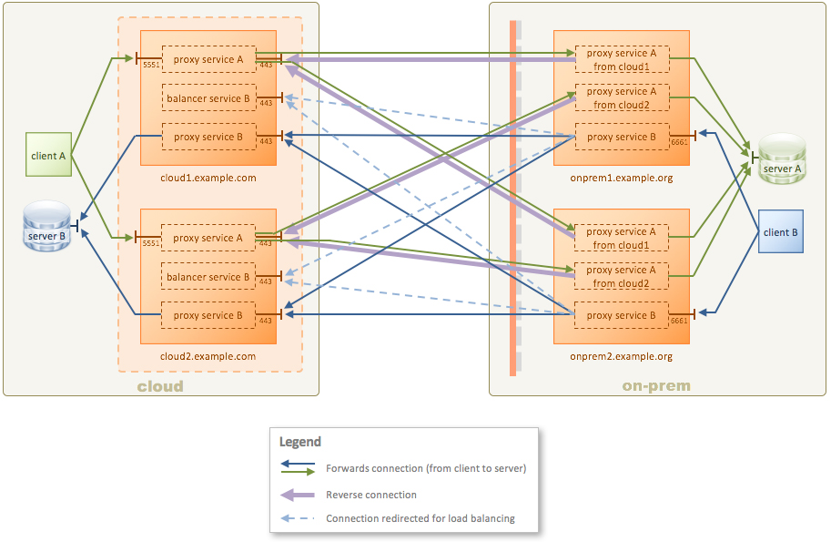

# KWIC HA (High Availability)

(**Note:** Please complete the [1-Simple](../1-simple), [2-tls](../2-tls), and [3-multi-tenant](../3-multi-tenant) tutorials before starting this one.)

Demonstrate a KWIC scenario with HA (High Availability).



In this tutorial, the cloud has two KWIC instances and the on-premise has two KWIC instances. If any single instance fails on either side – or both sides – there is still a path for clients to connect.

There is no requirement that both sides have the same number of instances; the example in this tutorial is simply using the minimum for HA on both sides.

## Configuration

The configuration for the cloud KWIC instance is in [config/cloud-config.xml](config/cloud-config.xml).

The configuration for the on-prem KWIC instance is in [config/onprem-config.xml](config/onprem-config.xml).

This tutorial uses TLS, so all keys, certificates, and other TLS artifacts are generated automatically when the Docker Compose suite starts.

# Requirements

* You will need Docker and Docker Compose.

* If you don't have **netcat** installed on your system (the `nc` command) then you will need to use a netcat substitute.

See the the **Requirements** section in the [main README](../../README.md) for details of the above.

This tutorial does not need any modification to your hosts file.

# Running the tutorial

In this tutorial you will use **netcat** for the TCP clients **client A**, **client B**. You run netcat by specifying a hostname or IP address, and a port. Once it is connected, you can type something and hit Enter, and you will see your message echoed back from the server.

If you are running on Windows, or don't have netcat installed, everywhere you see `nc 192.168.99.100 5551` in the steps below, replace it with the following command:

```bash
docker run -it --rm konjak/netcat 192.168.99.100 5551
```

## Steps

1. In a terminal window, use Docker Compose to launch all of the Docker containers:

    ```bash
    $ docker-compose up
    ```

    It may take a few moments for all of the containers to start. It's probably ready when you see something like the following lines in the log output on the screen:

    ```
    cloud2.example.com_1   | INFO  HAZELCAST: [Member [172.34.0.5]:5941 - 01c5205d-549f-4946-a60d-3656ad91ab87 this] - [172.34.0.5]:5941 [kzha] [3.7.4] All migration tasks have been completed, queues are empty.
    onprem2.example.org_1  | INFO  [tcp#5 172.34.0.2:38192] OPENED: (#00000005: kaazing tcp, client, /172.34.0.2:38192 => /172.34.0.7:443)
    cloud1.example.com_1   | INFO  [tcp#1 172.34.0.2:38192] OPENED: (#00000001: kaazing tcp, server, /172.34.0.2:38192 => /172.34.0.7:443)
    onprem1.example.org_1  | INFO  [tcp#5 172.34.0.3:47910] OPENED: (#00000005: kaazing tcp, client, /172.34.0.3:47910 => /172.34.0.7:443)
    cloud1.example.com_1   | INFO  [tcp#2 172.34.0.3:47910] OPENED: (#00000002: kaazing tcp, server, /172.34.0.3:47910 => /172.34.0.7:443)
    onprem2.example.org_1  | INFO  [ssl#6 172.34.0.2:38192] OPENED: (#00000006: kzg ssl, client, ssl://cloud1.example.com:443 => ssl://cloud1.example.com:443)
    onprem2.example.org_1  | INFO  [wsn#8 172.34.0.2:38192] OPENED: (#00000008: kzg wsn, client, ws://cloud1.example.com:443/kwic => wss://cloud1.example.com/kwic)
    cloud1.example.com_1   | INFO  [wsn#5 172.34.0.2:38192] OPENED: (#00000005: kzg wsn, server, ws://cloud1.example.com:443/kwic => wss://cloud1.example.com/kwic)
    onprem1.example.org_1  | INFO  [ssl#6 172.34.0.3:47910] OPENED: (#00000006: kzg ssl, client, ssl://cloud1.example.com:443 => ssl://cloud1.example.com:443)
    cloud1.example.com_1   | INFO  [wsn#8 172.34.0.3:47910] OPENED: (#00000008: kzg wsn, server, ws://cloud1.example.com:443/kwic => wss://cloud1.example.com/kwic)
    onprem1.example.org_1  | INFO  [wsn#8 172.34.0.3:47910] OPENED: (#00000008: kzg wsn, client, ws://cloud1.example.com:443/kwic => wss://cloud1.example.com/kwic)
    ```

    Those lines indicate that the on-prem instance established a TLS-based reverse connection to the cloud instance.

1. In another terminal window, test **client A** connecting to **server A** using netcat. Once it is connected, type `hello` and hit Enter. You will see your message echoed back. Type some more messages if you like, pressing Enter each time. When done, press Ctrl-C to exit netcat. Then do the same for **client B**

    If you don't have netcat installed, then do `docker run -it --rm konjak/netcat 192.168.99.100 5551`.

    If you successfully see the message echoed back, then you know there was roundtrip communication from the netcat client, through the cloud KWIC instance, through the on-prem KWIC instance, to the endpoint **server A**, and back.

    Both `cloud1` and `cloud2` listen on port 5551. Since we are running on a single machine with Docker, the ports need to be disambiguated to avoid a port conflict. The Docker Compose configuration for `cloud2` has been configured to listen to port 5552 and forward that traffic to port 5551 in the container for `cloud2`.

    ```bash
    # Test client A to server A via cloud1
    $ nc 192.168.99.100 5551
    hello
    hello
    ^C
    # Test client A to server A via cloud2
    $ nc 192.168.99.100 5552
    world
    world
    ^C
    ```

1. Test **client B** connecting to **server B** using netcat.

    Both `onprem1` and `onprem2` listen on port 6661. Since we are running on a single machine with Docker, the ports need to be disambiguated to avoid a port conflict. The Docker Compose configuration for `onprem2` has been configured to listen to port 6662 and forward that traffic to port 6661 in the container for `onprem2`.

    ```bash
    # Test client B to server B via onprem1
    $ nc 192.168.99.100 6661
    foo
    foo
    ^C
    # Test client B to server B via onprem2
    $ nc 192.168.99.100 6662
    bar
    bar
    ^C
    ```

1. Test the failure case for `cloud1` by bringing it down:

    ```bash
    $ docker-compose stop cloud1.example.com
    ```

    Test that **client A** can still connect via `cloud2`, and that **server B** can still connect via both `onprem1` and `onprem2`:

    ```bash
    # Test client A to server A via cloud2
    $ nc 192.168.99.100 5552
    world
    world
    ^C

    # Test client B to server B via onprem1
    $ nc 192.168.99.100 6661
    foo
    foo
    ^C
    # Test client B to server B via onprem2
    $ nc 192.168.99.100 6662
    bar
    bar
    ^C
     ```

     Restart `cloud1`:

    ```bash
    $ docker-compose start cloud1.example.com
    ```

1. Test the failure case for `cloud2` by bringing it down:

    ```bash
    $ docker-compose stop cloud2.example.com
    ```

    Test that **client A** can still connect via `cloud1`, and that **server B** can still connect via both `onprem1` and `onprem2`:

    ```bash
    # Test client A to server A via cloud1
    $ nc 192.168.99.100 5551
    hello
    hello
    ^C

    # Test client B to server B via onprem1
    $ nc 192.168.99.100 6661
    foo
    foo
    ^C
    # Test client B to server B via onprem2
    $ nc 192.168.99.100 6662
    bar
    bar
    ^C
     ```

     Restart `cloud1`:

    ```bash
    $ docker-compose start cloud2.example.com
    ```

1. Repeat the same tests with the on-premise instances:

    ```bash
    $ docker-compose stop onprem1.example.com

    # Test client A to server A via cloud1
    $ nc 192.168.99.100 5551
    hello
    hello
    # Test client A to server A via cloud2
    $ nc 192.168.99.100 5552
    world
    world
    ^C

    # Test client B to server B via onprem2
    $ nc 192.168.99.100 6662
    bar
    bar
    ^C

    $ docker-compose start onprem1.example.com

    $ docker-compose stop onprem2.example.com

    # Test client A to server A via cloud1
    $ nc 192.168.99.100 5551
    hello
    hello
    # Test client A to server A via cloud2
    $ nc 192.168.99.100 5552
    world
    world
    ^C

    # Test client B to server B via onprem1
    $ nc 192.168.99.100 6661
    bar
    bar
    ^C

    $ docker-compose start onprem2.example.com
    ```
