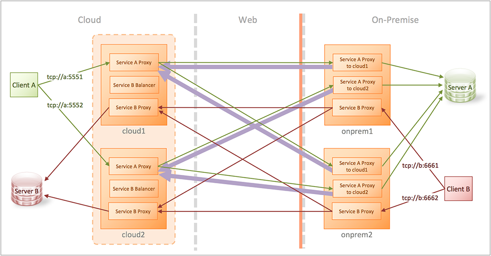

# KWIC HA

Demonstrate KWIC with high availability on both sides.



Both services are stubbed out with echo services.  Service A uses the reverse connection.  Service B uses forward proxies.  The forward proxies use a balancer service. The reverse proxies uses 2 services on each on-premise gateway (one for each cloud gateway).

# Prerequisites

* Have Docker installed
* Have Docker Compose installed
* Added a host file entry for `example.com`, as described [here](https://github.com/kaazing/docker.tutorials/blob/develop/README.md)

# Running the tutorial

Sample commands

```bash
$ docker-compose up

## Test each service
$ nc 192.168.99.100 5551
what
what
^C
$ nc 192.168.99.100 5552
what
what
^C
$ nc 192.168.99.100 6661
what
what
^C
$ nc 192.168.99.100 6662
haha
haha

## Test in case of failure
$ docker-compose stop onprem1.example.org
$ nc 192.168.99.100 5551
what
what
^C
$ nc 192.168.99.100 5552
ahah
ahah
^C

$ docker-compose start onprem1.example.org
$ docker-compose stop onprem2.example.org

Davids-MacBook-Pro-2:~ David$ nc 192.168.99.100 5551
what
what
^C

Davids-MacBook-Pro-2:~ David$ nc 192.168.99.100 5552
whata
whata
^C

$ docker-compose start onprem2.example.org
$ docker-compose stop cloud1.example.com

$ nc 192.168.99.100 6661
what
what
^C

$ nc 192.168.99.100 6662
what
what
^C

$ docker-compose start cloud1.example.com
$ docker-compose stop cloud2.example.com

$ nc 192.168.99.100 6661
what
what
^C

$ nc 192.168.99.100 6662
what
what
^C

$ docker-compose start cloud2.example.com

```
