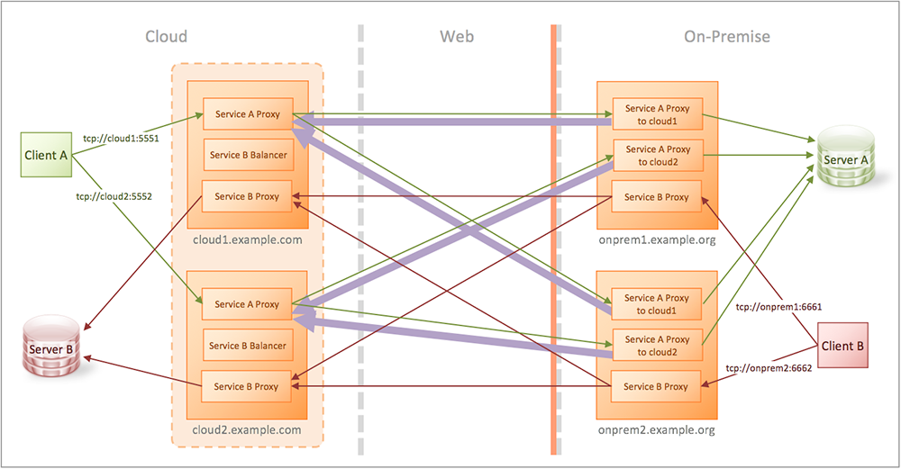

# KWIC High Availability (HA)

Demonstrate KWIC with high availability on both sides.



In this scenario, the on-premise side is behind a firewall. (There is no actual firewall deployed in this tutorial, but the configuration is consistent with a firewall being present.)

There are two gateways in the on-premise side for HA, labeled **onprem1** and **onprem2**. There are another two gateways on the cloud side for HA, labeled **cloud1** and **cloud2**.

The **cloud1** and **cloud2** gateways are clustered, as indicated by the dashed line around them.

Both end-point servers are stubbed out with echo services for simplicity  (**Server A** and **Server B**).

The `.com` domain is used to represent the cloud side, and the `.org` domain is used for the on-premise hosts to represent a wholly separate network.

## Reverse Case (Green)

The client is on the cloud side (shown as **Client A**) connecting to **Server A** in the on-premise side. The purple arrows indicate a (pyhiscal) reverse connection made from the on-premise gateway to the cloud gateway. This reverse connection is then consumed by the (logical) forwards connection created when the client connects.

When the **Service A Proxy** service receives a connection from the client, it will choose one of the pre-created reverse connections from **onprem1** or **onprem2**, who will then proxy the connection to **Server A**.

If either **onprem1** or **onprem2** go down, there is still a path forward for the **Service A Proxy** service.

## Forwards Case (Red)

The client is in the on-premise side (shown as **Client B**) connecting to **Server B** in the cloud. No reverse connectivity is requried for this case because the connections are outbound through the firewall, which is permissable.

When the **Service B Proxy** service receives a connection from **Client B**, it will proxy to the public address of `example.com`. This will resolve to the IP address of either **cloud1** or **cloud2**, who will redirect the request to one of the nodes in the cluster. This is how the load balancing takes place independently of DNS round robin.

The redirect will connect the **Service B Proxy** service in the on-premise side with the a **Service B Proxy** service on the cloud side, who will proxy to **Server B**.

If either **cloud1** or **cloud2** go down, there is still a path forward for the **Service B Proxy** service in the on-premise side.

# Requirements

See the the **Requirements** section in the [main README](../../README.md).

This tutorial does not need any modification to your hosts file.

# Running the tutorial

In this tutorial we use **netcat** for the TCP client **Client A** and **Client B**. You run **netcat** by specifying a hostname or IP address, and a port. Once it is connected, you can type something and hit Enter, and you will see your message echoed back.

If you are running on Windows, or don't have **netcat** installed, everywhere you see `nc 192.168.99.100 5551` in the steps below, replace it with the following command:

```bash
docker run -it --rm konjak/netcat 192.168.99.100 5551
```

When you connect with **netcat** and type messages, watch the terminal window where Docker Compose is running, and you'll see from the gateway logging output which gateways are being used.

The following steps also have you bring down a gateway so you see that connectivity still succeeds, i.e., high availability.

## Sample commands

```bash
$ docker-compose up

## Test each service
$ nc 192.168.99.100 5551
hello
hello
^C
$ nc 192.168.99.100 5552
hello
hello
^C
$ nc 192.168.99.100 6661
hello
hello
^C
$ nc 192.168.99.100 6662
hello
hello
^C

## Test the failure case
$ docker-compose stop onprem1.example.org
$ nc 192.168.99.100 5551
foo
foo
^C
$ nc 192.168.99.100 5552
foo
foo
^C

$ docker-compose start onprem1.example.org
$ docker-compose stop onprem2.example.org

$ nc 192.168.99.100 5551
foo
foo
^C

$ nc 192.168.99.100 5552
foo
foo
^C

$ docker-compose start onprem2.example.org
$ docker-compose stop cloud1.example.com

$ nc 192.168.99.100 6661
bar
bar
^C

$ nc 192.168.99.100 6662
bar
bar
^C

$ docker-compose start cloud1.example.com
$ docker-compose stop cloud2.example.com

$ nc 192.168.99.100 6661
bar
bar
^C

$ nc 192.168.99.100 6662
bar
bar
^C

$ docker-compose start cloud2.example.com

```
