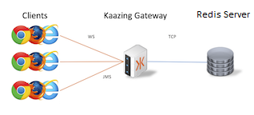

# Redis and WebSocket  

The Gateway can be configured as a Redis proxy, talking to a back-end Redis server and allowing WebSocket Redis clients to connect. Example configurations are shown for:

* [Redis](redis)

