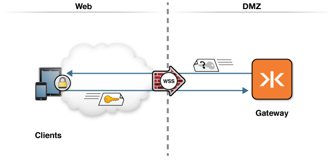

# Authenticating Users

The following topology graphic depicts how this scenario would be deployed in an enterprise environment.

The Gateway can be configured for user authentication.  A user is authenticated at the HTTP layer prior to the WebSocket handshake negotiation.

There are several ways to configure user authentication, including:

* [Authentication File](file)
* LDAP - example coming soon
* Custom Login module - example coming soon
* Kerberos - example coming soon
