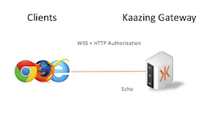

# User Authentication 

This tutorial shows how to authenticate a user with the Gateway over WebSocket.

### Getting Started

To run this example you must have installed Docker and have added a host file entry for `kaazing.example.com`, as described [here](../README.md)

The [docker-compose.yml](docker-compose.yml) file describes one container: the Gateway.  



The Gateway container will run an Echo service that allows WebSocket clients to connect on the front-end. Clients will connect on a `wss://` address which denotes a TLS-secured WebSocket URL. Clients will be prompted for user authentication. The [Gateway config file](gateway/echo-auth-gateway-config.xml) is configured with an Echo service as follows:

```xml
<service>
  <name>WSS Echo</name>
  <description>A service that echo's messages back for WSS</description>
  <accept>wss://kaazing.example.com:8000/</accept>

  <type>echo</type>

  <!-- Specifies what security realm to use to authenticate users-->
  <realm-name>tutorial</realm-name>

  <!-- Specifies what role users need to have to access the service -->
  <authorization-constraint>
    <require-role>AUTHORIZED</require-role>
  </authorization-constraint>

  <cross-site-constraint>
    <allow-origin>https://kaazing.example.com:8000/</allow-origin>
  </cross-site-constraint>
</service>
```

A realm is added to the `security` section of the configuration file that tells the Gateway how to authenticate users:

```xml
<realm>
  <name>tutorial</name>
  <description>Challenges Users for Credentials</description>
  <authentication>
    <!--
    basic http challenge scheme sends a "Basic" challenge
    as specificed in rfc7235.  There are several options
    that could be used instead that allow programmatic
    access on the client to set/get the credentials. See:
    http://kaazing.com/doc/5.0/security/p_authentication_config_http_challenge_scheme/
    -->
    <http-challenge-scheme>Basic</http-challenge-scheme>
    <login-modules>
      <login-module>
        <!--
        States how users and roles are validated, the file is the easiest,
        but several other options exist, including writing your own custom
        login module, See:
        http://kaazing.com/doc/5.0/security/p_auth_configure_login_module/
        -->
        <type>file</type>
        <success>required</success>
        <options>
          <file>jaas-config.xml</file>
        </options>
      </login-module>
    </login-modules>
  </authentication>
</realm>

```

The realm is configured with a login module file that reads user credentials and roles in the [jaas-config.xml](gateway/jaas-config.xml). The jaas-config.xml file is added to the Gateway in the [dockerfile](gateway/Dockerfile).

### Run

1. Start the containers
  ```bash
  docker-compose up -d
  ```

2. Connect to the Gateway in a Web browser via `https://kaazing.example.com:8000/`. You will see a security error saying the certificate is not trusted. This error is the result of using a self-signed certificate. Proceed anyways (in Chrome this is under the **Advanced** drop-down menu). This step will temporarily add the generated self-signed certificate to your computer's truststore.

3. Change the connect URL of the demo to `wss://kaazing.example.com:8000/` and connect. You will be prompted for login credentials. Use the following: **Username:** `joe`, **Password:** `welcome`. 

4.  When you send a message it will echo back to you.

### Next Steps
  
[See Deployment Scenarios](../../README.md#deployment-scenarios)
