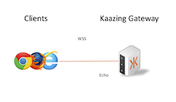

# WSS

This example shows how to configure TLS with Websockets.  This can be applied to any WebSocket service in the gateway, the examples here show it done for the following:

* [echo service](echo)
