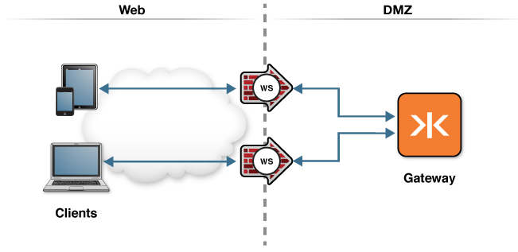

# WSS (WebSocket Secure)

The following topology graphic depicts how this scenario would be deployed in an enterprise environment.

This example shows how to configure TLS with WebSocket. This scenario can be applied to any WebSocket service on the Gateway. The examples in this repo demonstrate TLS with WebSocket for the following service:

* [Echo service](echo)
